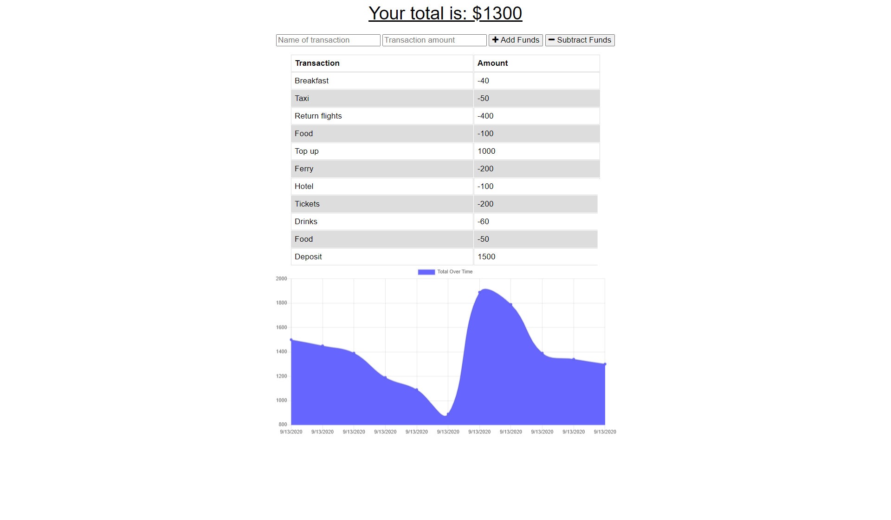

   
   
   
   
   
   
  

  # Welcome to Budget Tracker

  ## Table of Contents

  * [Description](#Description)
  * [Demonstration](#Demonstration)
  * [Setup](#Setup)
  * [Usage](#Usage)
  * [License](#License)
  * [Contributions](#Contributions)
  * [Version](#Version)
  * [Tests](#Tests)
  * [Questions](#Questions)

  ## Description

  This is a handy Progressive Web Application  for tracking expenses while travelling. The application can be installed on a mobile device and run with or without an internet connection. When running in offline mode, the app will store your transactions in a local database temporarily. When an internet connection becomes available again, the application will sync your transactions with an online database where they can be accessed from any device.

  ## Demonstration

  View a live demonstration here: https://fast-anchorage-29235.herokuapp.com/.

  #### Screenshot

  

  ## Setup

  To install locally, clone the repository and then run `npm i` to install required packages. To run the application, run `npm start`. The live application can be accessed using the link provided above. No installation is necessary. The app can be saved in the applications menu of mobile devices by selecting `Add to home screen` or a similar option.

  ## Usage

  Enter your transaction reference and amount. Then hit add or subtract to log it.

  ## License

  

  You may utilize this application under the terms of the [MIT license](public/license/MIT.txt).

  ## Contributions

  Make a pull request for suggested changes or fixes and I will review and approve it as necessary.

  ## Version

  

  ## Tests

  No tests available currently.

  ## Questions

  If you have further questions or would like to see more features, please contact me via github or email:

  https://github.com/bdcoelho 

  budget-tracker

  